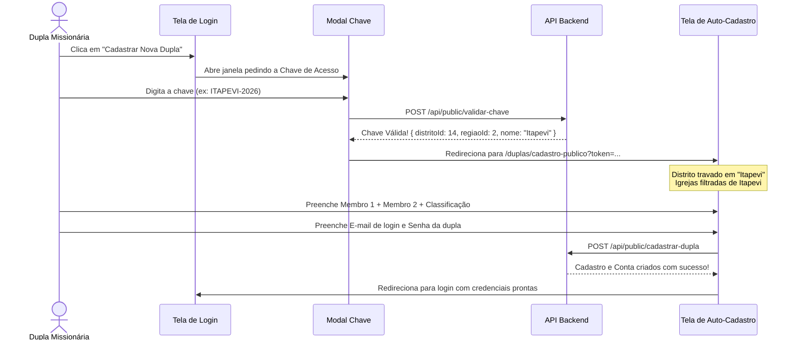

# Plano de Implementação: Auto-Cadastro de Duplas Missionárias com Chave de Acesso

Este documento apresenta a proposta arquitetural, design e fluxo de implementação para permitir que **novas duplas missionárias se auto-cadastrem diretamente a partir da tela de login** mediante o uso de uma **Chave de Acesso** fornecida pelo Pastor Distrital ou Coordenador Regional.

---

## 1. Visão Geral e Viabilidade

> [!TIP]
> **Será que é possível e seguro fazer isso?**
> **Sim, 100% viável, elegante e muito seguro!**  
> É o modelo padrão de ouro utilizado por grandes plataformas comunitárias e eclesiásticas: combina a facilidade de auto-cadastro com o controle de acesso de liderança (*gatekeeper* via chave/token), impedindo que usuários desconhecidos na internet poluam o banco de dados.

---

## 2. Design do Botão na Tela de Login

A tela de login atual possui o card branco à direita com os campos de E-mail, Senha e o botão azul **"Entrar"**.  
Abaixo do botão "Entrar", propomos adicionar um separador sutil e um botão de grande destaque e apelo visual:

```
┌────────────────────────────────────────────────────────┐
│                      [ Entrar ]                        │
└────────────────────────────────────────────────────────┘
                           ── ou ──
┌────────────────────────────────────────────────────────┐
│  ✨  Cadastrar Nova Dupla Missionária                  │
│      Use a chave de acesso do seu pastor ou coord.     │
└────────────────────────────────────────────────────────┘
```

### Propostas de Estilo para o Botão:

1. **Opção Dourada / Destaque Institucional (Recomendada)**:
   - **Visual**: Fundo branco ou âmbar muito suave (`bg-amber-50/70`), borda destacada em dourado institucional (`border-2 border-[#C9963A]`), texto em azul marinho (`text-[#1A3A6B] font-bold`) com ícone de duas pessoas (`👥`) e brilho/estrela dourada (`✨`).
   - **Micro-cópia**: *"Fazer parte de uma Dupla Missionária"*.
   - **Sensação**: Acolhedora, nobre e chama a atenção imediatamente de quem ainda não tem login.

2. **Opção Card de Convite Integrado**:
   - Um bloco arredondado abaixo com fundo `bg-slate-50 border border-slate-200 p-3.5`:
     - Título: *"Você é uma dupla missionária?"*
     - Botão compacto: `[ Iniciar Cadastro com Chave ]`.

---

### 3. Arquitetura da Chave de Acesso: Pastor vs. Coordenador

Para responder à sua pergunta sobre quem deve ter a chave e como os distritos devem se comportar, **a melhor abordagem é um modelo hierárquico inteligente com Chaves de Escopo**:

### Como funciona cada Chave:

| Tipo de Chave | Quem fornece? | O que acontece ao digitar a chave no cadastro? |
| :--- | :--- | :--- |
| **Chave Distrital** *(Recomendada para o dia a dia)* | **Pastor Distrital** | - A **Região** e o **Distrito** ficam **automaticamente preenchidos e travados**.<br>- O campo **Igreja** exibe **somente as igrejas daquele distrito**.<br>- Evita que o membro erre o nome do distrito ou escolha igrejas de outra região. |
| **Chave Regional** | **Coordenador Regional** | - A **Região** fica **automaticamente travada**.<br>- O campo **Distrito** exibe **apenas os distritos daquela região específica**.<br>- Ao selecionar o distrito, o campo Igreja filtra para as igrejas do distrito escolhido. |

---

## 3.1. Onde e como líderes visualizam as chaves: Aba em Configurações

A melhor e mais elegante solução — exatamente como você sugeriu — é adicionar uma nova aba **"Chaves de Acesso"** na página de **Configurações** (`/configuracoes`), ao lado de "Gestão de usuários":

```
[ Conta ]   [ Gestão de usuários ]   [ ✨ Chaves de Acesso ]   [ Backup dos dados ]
```

### Como cada perfil visualiza a aba "Chaves de Acesso":

1. **SUPER_ADMIN / ADMINISTRADOR**:
   - Vê **todas** as chaves de acesso da Associação Paulistana.
   - Visualização dividida em duas abas ou blocos:
     - **Chaves por Região**: Tabela com todas as 8 Regiões, suas chaves (ex: `REGIAO-1-2026`), status (Ativa/Inativa), botão de copiar chave, copiar mensagem de WhatsApp e opção de editar/regenerar.
     - **Chaves por Distrito**: Lista de todos os Distritos com filtro rápido por Região e barra de busca. Mostra o nome do pastor responsável, o código da chave distrital (ex: `ITAPEVI-2026`), botões de cópia e controle.
   - Pode editar qualquer chave manualmente se desejar uma sigla personalizada.

2. **COORDENADOR REGIONAL / PASTOR REGIONAL**:
   - Vê **apenas o que está ligado à sua região**:
     - **Card Superior de Destaque**: Chave Geral da sua Região com botão de copiar código e copiar convite para WhatsApp.
     - **Lista dos Distritos da sua Região**: Tabela clara com os distritos subordinados à sua região e as chaves de cada um, permitindo que ele apoie os pastores distritais caso precisem.

3. **PASTOR DISTRITAL**:
   - Vê **exclusivamente a chave do seu distrito**:
     - Um card de destaque personalizado com o nome do seu Distrito e Região.
     - O código da chave em estilo *ticket/voucher* dourado e nítido (ex: `ITAPEVI-2026`).
     - **Botão "Copiar Chave"**: copia apenas o código.
     - **Botão "Copiar Mensagem WhatsApp"**: copia um texto pronto e formatado para enviar aos irmãos da igreja.
     - **Botão "Copiar Link Direto"**: gera um link como `.../login?chave=ITAPEVI-2026` que já abre com a chave preenchida e distrito travado.

4. **DUPLAS MISSIONÁRIAS / LEITURA**:
   - Não veem essa aba, preservando o sigilo e controle de acesso.

---

## 4. Fluxo Passo a Passo do Usuário



---

## 5. Regra Anti-Duplicidade de Nomes

> [!IMPORTANT]
> **Como garantir que a dupla não seja cadastrada duas vezes?**
> 1. O usuário preenche o **Nome do Membro 1** e o **Nome do Membro 2**.
> 2. Ao avançar ou clicar em salvar, o backend realiza uma normalização (remove acentos, pontuação, múltiplos espaços e converte para minúsculas).
> 3. A consulta verifica se já existe qualquer dupla onde:
>    - `(Lider == Membro1 E Membro2 == Membro2)` **OU**
>    - `(Lider == Membro2 E Membro2 == Membro1)`
> 4. **Se for duplicado**: O sistema não permite salvar e exibe:
>    > *"⚠️ Atenção: Já existe uma dupla missionária registrada com estes nomes ([Nome 1] e [Nome 2]). Se vocês já fazem parte desta dupla e precisam do acesso ao sistema, solicitem o link/QR Code ao seu pastor ou coordenador."*

---

## 6. Criação Integrada de Login e Senha no Formulário

Conforme você observou perfeitamente nas imagens 2, 3, 4 e 5:
- O formulário atual possui as seções:
  1. Localização
  2. Membro 1 — Líder
  3. Membro 2 — Parceiro
  4. Classificação Missionária
- **Adicionaremos a Seção 5:**
  - **5. Acesso ao Sistema (Login da Dupla)**
    - **E-mail de acesso da dupla** *(ex: dupla.josefa.marcelo@gmail.com)*.
    - **Senha de acesso** *(mínimo de 8 caracteres, com botão para mostrar/ocultar)*.
    - **Confirmar senha**.
  - **No Auto-Cadastro Público (com chave)**: Esta seção é **obrigatória**, garantindo que ao concluir o formulário a dupla já saia com o acesso pronto para logar.
  - **No Cadastro Interno (`/duplas/nova` feito por líderes)**: Esta seção é **opcional** (se o pastor já souber o e-mail que eles querem, preenche na hora; se não preencher, o pastor pode usar o botão "Criar conta / QR Code" depois).

---

## 7. Estrutura de Banco de Dados Necessária

Para suportar as chaves de acesso com total segurança e flexibilidade:

```prisma
// Exemplo no schema do Prisma
model Distrito {
  id          Int      @id @default(autoincrement())
  nome        String
  chaveAcesso String?  @unique // Ex: "ITAPEVI-2026"
  chaveAtiva  Boolean  @default(true)
  ...
}

model Regiao {
  id          Int      @id @default(autoincrement())
  nome        String   @unique
  chaveAcesso String?  @unique // Ex: "REGIAO-1-2026"
  chaveAtiva  Boolean  @default(true)
  ...
}
```

---

## 8. Conclusão

Essa proposta atende 100% do que você imaginou:
1. Um botão atrativo e moderno na tela de login.
2. Acesso protegido por chave distribuída pelos líderes (Pastor ou Coordenador).
3. Travamento e filtragem automática de Região, Distrito e Igrejas conforme a chave informada.
4. Bloqueio automático contra duplas já cadastradas (mesmos dois nomes).
5. Definição do login e da senha no mesmo fluxo de cadastro.
